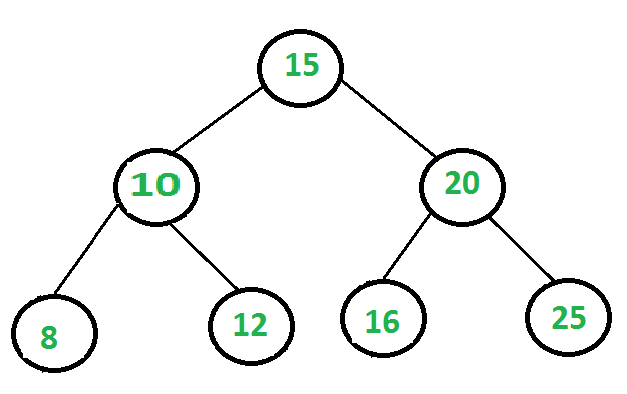
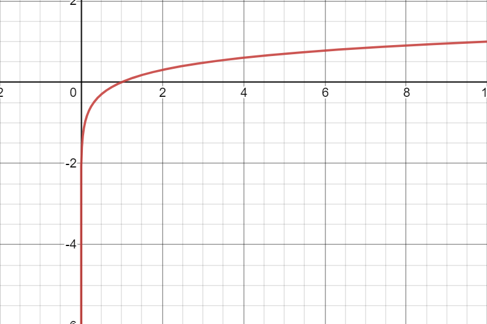

# Big O Notation
## I. *Linear Peformance*
Big O notation is a mathematical notation that describes the limiting behavior of a function when the argument tends towards a particular value or infinity.

When the term Big O notation is used in computer scienece or software engineering it is used to classify alogoritms according to how their run time or space requirements grow as the size of the input grows.

If we have two functions that accomplish the same task just done in different ways, we can use Big O notation to compare the performance of the two functions.

Take for example this code below to find the  letter d in a list:

```Python
def find_letter(letter_list):
    for letter in letter_list:
        if letter == "d":
            return True
        else:
            return False
```

The size of the data in this function is based on the size of the letter_list the function is iterating through. In this case we do not know the exact size of the data, so we will just call it ***n***. The ***for*** loop will potentially run ***n*** times until there is a match in the list. Worst case scenario is that ***n*** is not in the list. Therefore, the performance of the ***for*** loop is ***O(n)***. This function does not have a best case scenario, if `d` is the first of the iterations then we say it is ***O(1)***, this is sometimes called a `constant` time.

If we look at ***O(n)*** function as a graph we can say that it has a `Linear` performance. This simply means that the amount of data is `Linear` to the amount of work/time that the function has to do on the data. Using a graphing calculator ***([desmos.com](desmos.com))*** we can see the performance on a graph. Usually, small code fragments like an assignment is statement is ***O(1)***.


Here we can visually see the `Linear` performance of ***O(n)*** in the image above. The graph shows the following:

* `y = x` represents ***O(n)*** 
* When (or n) increases in size, the amount of work ***(y)*** also increases in a linear way.
* There is no definciency in ***O(n)*** it is always constant.

Take a look at the following code scenario:
 
 ```Python
 def multiple_loops(n):
    for i in range(n)):
        print(i)
    for j in range(n):
        print(j//2)
 ```

 Each ***for*** loop counts as ***O(n)***. ***O(n)*** + ***O(n)*** = ***O(2n)***. When we graph ***O(2n)*** we notice that the line slightly gets steaper as we can see in the image below.


## II. *Polynomial Performance*
```Python
for i in range(n):
    for j in range(n):
        print((i+1) ** (j+1))
```
If we take a look at the example below, and compare it to the previous ***for*** loop example we can see that the structure of the ***for*** loops are different. This being a Python example, structure matters. A loop placed inside another loop is called a nested loop. In this case it is a nested ***for*** loop, which has a performance of ***O(n^2)***. 


Take a look at the above image. Here is a visual representation of ***O(n^2)***. Notes to remember with ***O(n^2)***:
* Both ***for*** loops are operating on the data
* Because there are two loops operating on the data that means that the function is doing twice the work.
* Not the best for large amounts of data.

Now, something to note is that if you are working with small amounts of data you probably do not have to worry about performance because you will not notice a difference between ***O(n)*** and ***O(n^2)***. However, if you are working with large amounts of data you are going to want to be careful with performance. If we take a look at the graph we can say that each line represents each for loop. As the amount of data increases so does the amount of work the function has to do, but exponentially. So the more data the worse the performance becomes. This is something we will want to avoid because as programmers we want to produce the most efficient software that works large amounts a data. Take for example FaceBook, millions of people use their products daily and they have to worry about processing trillions of data each second/minute. They are going to want process that information with the most efficient alogorithms so that their systems do not slow down, and they start losing customers because they services are too slow.

## III. *Logarithmic Time - O(log n)*

In the world of Mathematics there is a term called logarithm, which is the inverse function to exponential.

```Python
while left <= right:
        middle = (left + right) // 2
        if value < data[middle]:
            right = middle - 1
        elif value > data[middle]:
            left = middle + 1
        else:
            return middle
    raise ValueError('Value is not in the list')
```
If we take a look below, we can see a balanced binary search tree. With O(log n) peroformance we are looking at a function that will keep halving thet data to find what it needs. This way we are working with less data, which means less work the function has to do on the set of data. Looking at the GIF below, you are seeing the performance O(n) because it is traversing the whole tree. However, if the function is looking for a number it will have to cut the data in half until it finds its number.  


 When working with large amounts of data this would be an ideal performance to consider using.


<!--  -->

Take a look at the graph below, we can see that as y increases the more the line starts to level out. If we put in prespective the performance of the above function that the more data we have to work with does not affect the performance of the function that much.



Throughout this tutorial we will put a lot of what we talked about into practice, so that we write better and more efficient code for different types of situations we will encounter. Be aware that we did not cover all the different types of perofrmances here, but there are many others that you will come across in your career as a programmer.

Some of the other different types of Big O notaiton may be seen in the diagram below.

