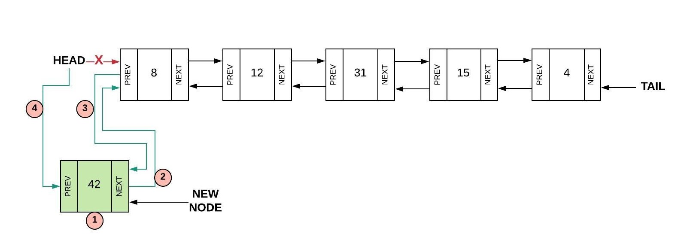

# The Linked List Data Structure

The Linked list data structure is a sequence of data connected by links. Each element in the list has a connection to the next and previous elements in the form of pointers. There are different types of linked list:

|Types of Linked List| Description|
|--------------------|------------|
|Simple Linked List| Item navigation is forward only.|
|Doubly Linked List| Items can be navigated forward and backwards.|
|Circular Linked List| Last item contains link of the first element as next and the first element has a link to the last element as previous.|
||

## Simple Linked List


(***source: https://realpython.com/linked-lists-python/***) 

In the diagram above is an example of a simple linked list. This type of linked list each node has a pointer to the next node; the pointers only flow in one direction.

***

## Doubly Linked List


(***source: https://realpython.com/linked-lists-python/***)

In the diagram above is an exampple of a doubly linked list.   

Each node also has a ***previous*** pointer to the node before it except for the **head** or the first node. Similarly, each node has a ***next*** pointer to the next node except for the tail whose pointer is set to none.


```Python
node.next = None
```

*** 

## Circular Linked List

(***source: https://realpython.com/linked-lists-python/***)

A circular linked list where every element has a link to the next element in the sequence. What makes it different from the other types of linked list is that the tail has a link to the first element .

***

Python does not have linked lists in its standard library. We implement the concept of linked lists using the concept of nodes.

```Python
class LinkedList:

    class Node:
        def __init__(self, data):
            self.data = data # Initializing the data
            self.next = None # Setting the next node to None (empty)
            self.prev = None # Setting the previous node to None (empty)
```

Implement the LinkedList data structure.  The Node class below is an 
inner class.  An inner class means that its real name is related to 
the outer class.  To create a Node object, we will need to 
specify LinkedList.Node.

## Inserting into a Linked List
***
When we are inserting inot a linked list, we only have to worry about the adjacent nodes. Because we are using pointers to connect the nodes, we do not need to worry about capacity like we do with a normal list or array. In this tutorial wwe are going to look at three methods that we need to be aware about ***Inset at the head***, ***insert at the tail***, ***and inset at the middle.***

### I. Steps to consider when inserting at the head:

```Python
# Create a new node.
new_node = LinkedList.Node(value)
```

### II. Set the "next" of the new node to the current head:
```Python
# Setting the "next" to the head.
new_node.next = self.head
```

### III. Set the "prev" of the current head to the new node:
```Python
# Setting the "prev" to the head
self.head.prev = new_node
```

### **IV. Set the head equal to the new node:**
```Python
self.head = new_node
```


***(source: https://byui-cse.github.io/cse212-course/lesson07/07-prepare.html)***

### I. Steps to consider when inserting at the head:

```Python
# Create a new node.
new_node = LinkedList.Node(value)
```

### II. Set the "next" of the new node to the current head:
```Python
# Setting the "next" to the head.
new_node.next = self.head
```

### III. Set the "prev" of the current head to the new node:
```Python
# Setting the "prev" to the head
self.head.prev = new_node
```

### IV. Set the head equal to the new node:
```Python
self.head = new_node
```


***(source: https://byui-cse.github.io/cse212-course/lesson07/07-prepare.html)***

Things to add to the tutorial:
* Practice problems 
* pefromance
* conclusion