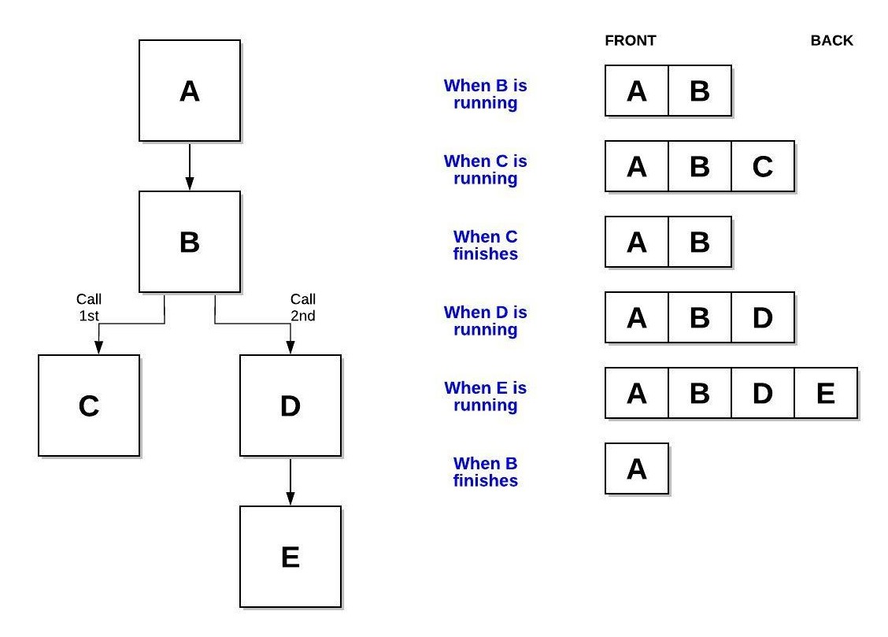

# The Stack Data Structure

A stack is a linear data structure that follows a particular order. That order is LIFO (Last in First Out). Take for example the the diagram below:

***(source: https://www.geeksforgeeks.org/stack-data-structure/)***

**Some real life examples of a stack may include:**
* Stack of plates.
* Deck of cards.
* Cars in a drive that is only one way.

**Some computing examlpes of stacks include:**
* Back/Forward tabs on browsers.
* Undo/Redo command in most applications.
* Activation records of method calls. 

**Methods used with this abstract data type contain:**

* *append()* - Adds an element to the end of the list.
* *pop()* - Method removes the element at the spcified position.
* *len()* - Returns the number of elements in the list.
* *push()* - Inserts an element at the top of a stack.
* *top()* - Returns a reference from the top of the stack.

***(source: https://byui-cse.github.io/cse212-course/lesson03/03-prepare.html)***

Take a look at [Stack example 1](./stackExample01.py) to see some of these methods in use.

Push and pop are probably the methods that you will use the most when dealing with this type of linear data structure. Push adds an element unto the stack, while pop removes it fromt the stack. In the case with the stack you will push and pop items from the back because it follows the LIFO (last in first out) operation.

|Common Stack Operartion |Description |Python Code | Performance|
|------------------------|------------|------------|------------|
|push(item) |Adds "item" to the back of the stack.|my_stack.append(value)|O(1) - Performance of adding to the end of a dynamic array.|
|pop()|Removes and reutrns the item from the back of the stack.|value = my_stack.pop()|O(1) - Performance of removing from the end of a dynamic array.|
|size()|Reutrns true if the length of the stack is zero.|if len(my_stack) == 0: *#code goes here*|O(1) - Performance of returning the size of the dynamic array.|
|empty()|Returns true if the length of the stack is zero.|if len(my_stack) == 0: *#code goes here*|O(1) - Performance of checking the size of the dynamic array.|

Stack is a great data structure when it comes to memory, so features such as undo will revert changes back in the right order.For example, what if I typed *"I am going to the shop!"* Each time I typed a charater from the keyboard it will be added to a stack, and when I pressed undo it may look something like this:

 You can see the LIFO operation very clearly in the above GIF.

Fun fact about stacks, even if you have not heard of them before this little tutorial, you have actually been using them in all the software that you have written in the past. Take for example whem we call a function, There are two things that we tell the computer when we call a function:

* Which function we want to call.
* Which funtion to go back to when we are done.

If we are in function A, we can expect to call function B. However, the next question is, "How do we tell the computer to return to function A when function B is finished?" This can get even more complicated if want to call function C, D and E before it finishes. The computer can accomplish this by using the stack function. When we call a function it is pushed onto a stack. The function that is running will always be put on the back of the stack, and if we remember the back is equivalent to the top; take the analogy of the pancakes. Then when the function finishes it is popped off of the stack.

 Let's walk through a problem together, Take a look at [Stack example 2](./stackExample02.py). Follow the code clearly as you will be putting all that you have learned into practice with this next example.

## Practice on your own
* **
* Step by step desceibe the code in [Stack example 3](./stackExample03.py).
* From scratch create your code and use a stack to accomplish a real life task.

# Conclusion

Whenever we are examing code that has some for of data in it for example a list or a stack (and others), we need to be aware of why the data structure is being used. Data structures are used for both storing information in different ways for different scenarios. Stacks are used for when we want to remember where we were, just like retracing our steps.Knowing how different data structures work we can form a hypothesis when analyzing code to see what the code is doing.